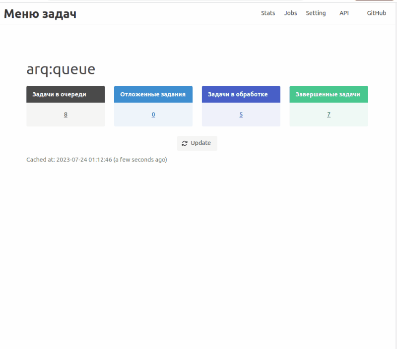

# Сервис обработки задач в фоновом режиме черз RQ(Redis Queue).

### Использованы:
- Python
- FastAPI
- FastAPI-Users
- SQLalchemy
- Redis
- ARQ-dashboard
- ARQ
- docker-compose
- PostgreSQL.
***
##  Запуск
### команда на линукс:
    sudo docker compose up 
### команда на windows:
    docker-compose up

(!!!! перед запуском на windows необходимо в папке docker у файлов entrypoint.sh поменять кодировки окончания строк с CRLF на LF)

По причине того что фреймворк FastAPI асинхронный, была взята библиотека "arq" для выполнения фоновых задач. 
И, как утверждает автор библиотеки, 
"arq" примерно в 7 раз быстрее, чем "rq" и существует готовая библиотека (графический интерфейс) 
для мониторинга на fastapi.
К сожалению сейчас каждый воркер работает в один поток. То есть один воркер поддерживает 
только одну очередь заданий и не поддерживает приоритезации для очередей. Исправил я это
переписав часть асинхронных библиотек "arq" и "arq dashboard", чтоб в одном воркере работали 3 очереди и в 
зависимости от приоритетов очереди воркер забирал задачи для выполнения. 

### Cтраница документации:
[http://0.0.0.0:8000/docs](http://0.0.0.0:8000/docs)

Путь графического интерфейса arq_dashboard: http://0.0.0.0:8000

Графический интерфейс для отслеживания текущих задач

  

***
Описание:
- Авторизация с помощью JWT-токена
- Можно получить список пользователей, создать и просматривать задачи
- Каждую минуту запускается задача по удалению задач, которые были завершены более 60 секунд назад. 
Это время можно определить самому изменив переменную виртуального окружения KEEP_RESULT в файле .env
